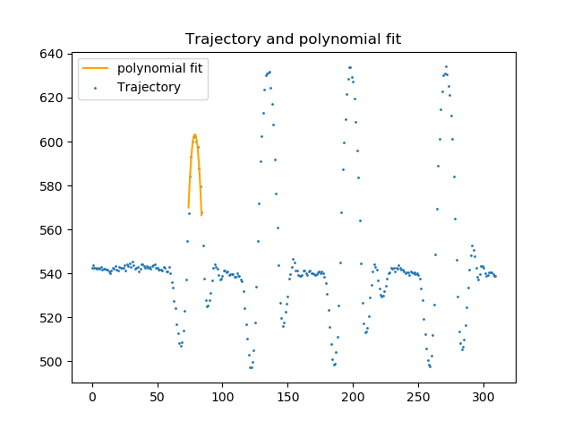

# README

## Purpose of the program

This program estimates the height based on a video. In the video, the person is jumping in front of the camera. This height is computed by comparing the gravitational constant g = 9.81 with the acceleration of the person in the video.  The detection of the person in the video is done using Alphapose.

## Setup
0. Install anaconda3 (see [Anaconda](https://www.anaconda.com/download/#linux))

1. Create a new python environment using anaconda by typing "conda create -n myenv python=3.6" It is important that you use the version 3.6 for python.

2. Install the following packages:
	* numpy
	* scipy
	* tqdm
	* matplotlib
	* opencv (please see **Note 2** about this package below)

3. Put the video in one folder (named for example Data).

4. If you want compute the correction term for the size of the person, please also put the two directories "All/" and "JS/All/" in the directory where you have the video. The first directory contains the different pictures of the different persons (the ones without the Alphapose keypoints and the ones with) while the second contains the json files corresponding to the images of the first directory. Note that the files will not be provided.

Note 1: If you prefer, you can directly run the small bash script named `setup.sh` that will do the first two points of the section "Setup" for you. This script was tested on Ubuntu 18.04 with anaconda3 already installed.

Note 2: In order to install opencv, you can directly do: **pip install opencv-python**. You can also completely build it following the tutorial on [http://alexsm.com/building-opencv-with-conda](http://alexsm.com/building-opencv-with-conda). You can also decide not to use opencv. In this case do not specify the optional argument --cv! The precomputed value will be directly used (see section "Running the code").

***
## Example

Here is a small example to test the code. Every datas are saved in the directory "example".

First go to the directory "example". You will find every data needed to fully run the code. The json file generated correspond to the video provided in the directory.

Since the jsonfile is already provided you can directly launch:

`python ../Code/run.py --json DidierBounce4m.json --verbose 1`

You should get the following output in the console:

_Decomposition of the json file into multiple json files in the directory Jsonfiles_

_rm: cannot remove 'JsonFiles/': No such file or directory
Decomposition done successfuly_

_Computing the trajectory of the person from the json files and saved in the directory Trajectory_

_rm: cannot remove 'Trajectory': No such file or directory
Computing the trajectory done successfully_

_Computing the different arrays for the rest of the program_

_The different arrays are ready_

_Computing the acceleration in pixels_

_Using the precomputed correction term_

_Computing the acceleration in pixel done successfuly_

And you should get the image

 

When closing this figure, you get the estimated size in the console

_The height of the person is: 181.65 centimeters_

***
## Running the code

In order to run the code, you first need to go to the data directory and launch the following command:

`python path_to_python_files/run.py --video path_to_video/nameofvideo --json 0`

where "nameofvideo" is the name of the video you use in the algorithm, path_to_python_files is the path to the directory containing all the python files and path_to_video is the path to the video file

Then, generate the jsonfile using Alphapose (following the instruction in the section "Install and use AlphaPose"), save it in the data folder and launch the following command:

`python run.py --json path_to_jsonfile/nameofyourjsonfile.json`

where path_to_jsonfile is the path to the json file generated with Alphapose.

This will output the result for you. This is the easiest way to run the code. However, you can run the code using the different arguments of the program:
- `--video`: This is the name of the video in which you have someone jumping

- `--json`: This is either the name of your json file or 0 depending if you have already generated the json file from Alphapose or not. Note that when this argument is a name of a json file, the argument --video is ignored.

- `--cv` (Optional): This argument (if specified) must be equal to 1 or 0 depending if you want to use the compute the correction term for the size yourself (1) or use the precomputed one (0). See section "CV"

- `--output` (Optional): This argument (if specified) must be equal to 1 or 0 depending if you want to show every images when computing the correction term. Note that if you use the precomputed correction term, this argument has no effect on the program and will be ignored.

- `--randsac` (Optional): This argument (if specified) is the number of iterations to perform if we use the randsac algorithm (see [randsac](https://en.wikipedia.org/wiki/Random_sample_consensus) for more informations) to compute the acceleration in pixels

- `--verbose` (Optional): This argument (if specified) is either 1 or 0. It will specify if the output should be verbose (1) or not (0). The default behavior is not verbose.

- `--jump` (Optional): This argument (if specified) is the number of the jump, starting from 0. The default jump number is 0. Note that you need to specify a number of a jump that exists otherwise the code will crash.

- `--correction` (Optional): This argument (if specified) is either 0, 1 or 2. It selects the correction ratio to use. 0 is for the adult ratio, 1 is for the children ratio and 2 is for children/adult ratio (all together).

- `--ratio` (Optional): This argument(if specified) is a float number specifying the real ratio centimeters/pixels. This can be used to compute the error done when computing the estimated ratio using the algorithm.

- `--height` (Optional): This argument(if specified) is a integer number specifying the real height in centimeters. This can be used to compute the error done when computing the estimated height using the algorithm.

- `--method` (Optional): This argument (if specified) is either 0, 1, 2. It selects the method used to compute the estimated height. 0 is for the floor method, 1 is for the minimum-maximum method and 2 is for the difference method. The default method is the floor method.

- `--fps` (Optional): This argument (if specified) is the integer number of frames per second of the video. The default value is 30 FPS.

- `--matplotlib` (Optional): This argument (if specified) is either 0 or 1. 0 is for not using matplotlib library and 1 is for using it. The default value is 1 (use of matplotlib).

- `--range` (Optional): This argument (if specified) is of the form x,y with x and y 2 integer values with x<y. It select the frames that will be use to compute the size in pixel of the person. The default value is 0,100.

***
## Install and use AlphaPose

### Install

Go on [Alphapose](https://github.com/MVIG-SJTU/AlphaPose/tree/pytorch) and follow the installation provided on this GitHub page. Note that you will need to use a GPU!

### Use

- Create a directory _mydir_ in the same directory containing the directory for Alphapose. This locality of the folders is not necessary but if you don't do this, you will need to change the path when runnning the algorithm

- Put all the images you want to apply the algorithm on.

- Go in the directory in which you installed Alphapose and launch the following command:

`python demo.py --indir ../mydir/ --outdir ../mydir/ --sp --save_img`

Note that if you don't want to have the resulting images, you can remove the argument "--save_img" (if you don't create a set of images for computing the correction term for the size, you won't need to save the images)

A file named Alphapose-results.json in the directory _mydir_ that you can use for the rest of the program.

## CV

Applying the --cv argument when running the code means that you want to compute the correction ratio yourself. In order to use your own images, you need to use specific images. The persons must be standing bare foot on a white background. An example of images is provided in the directory "example/All/Body1A.jpeg" with the corresponding jsonfile in "example/JS/All/Body1A.json". The jpeg file and the json file must have the same name and be of the form "BodyXA" which X an integer.

## FAQ

1. When I run the code using --cv 1, I get the error "no module named cv2". What can I do?

You should create a new conda environment and reinstall everything except matplotlib. Then you need to rerun the code but this time using the argument "--matplotlib 0" to deactivate the use of the matplotlib library. Note that if this is still not working, redo the same but install opencv using "conda install -c conda-forge opencv".
